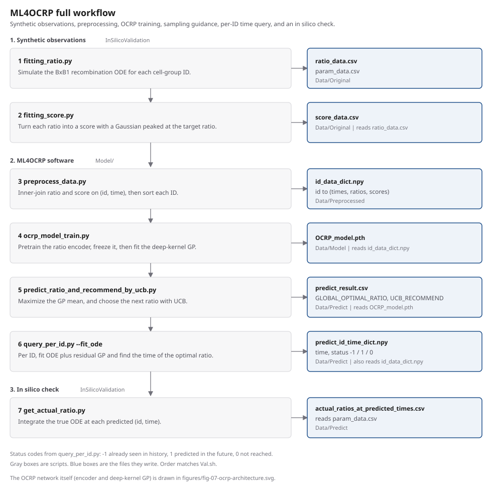
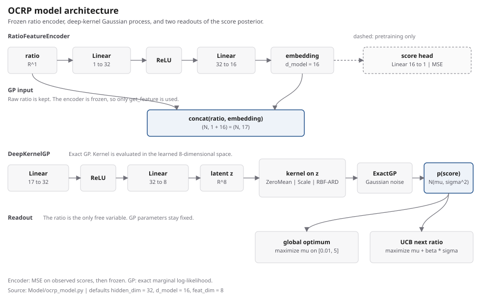
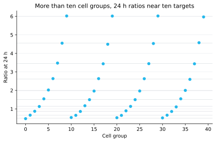
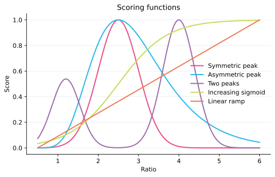
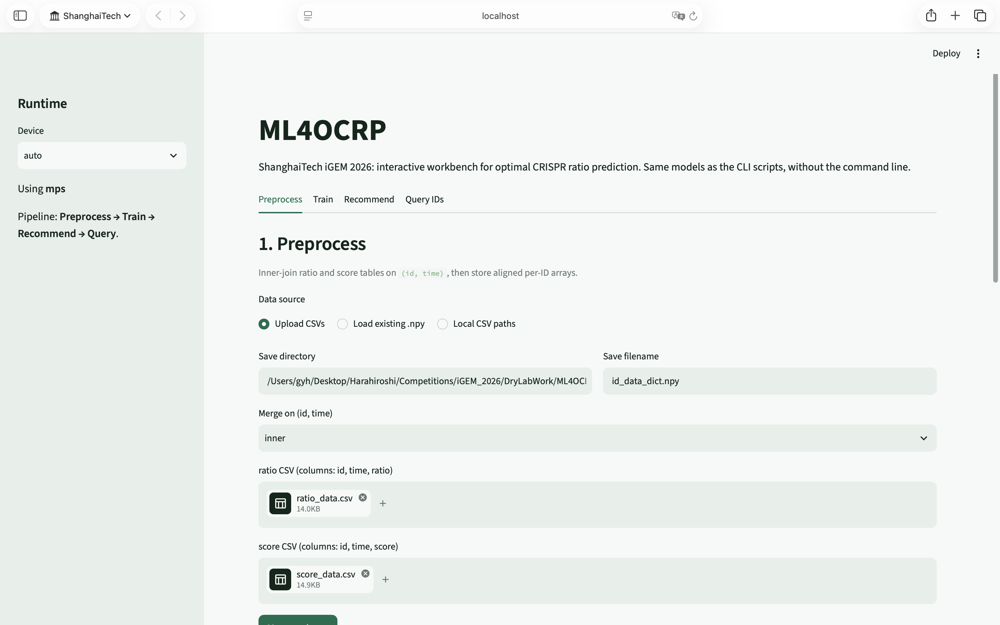
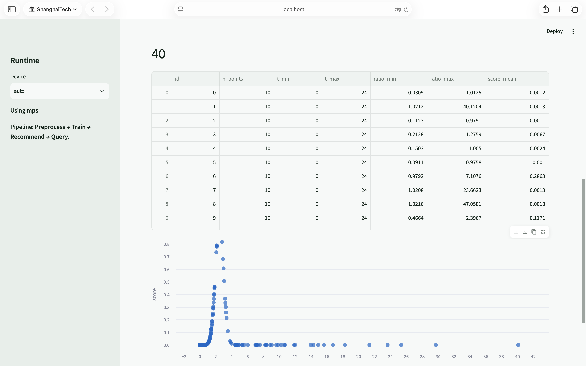
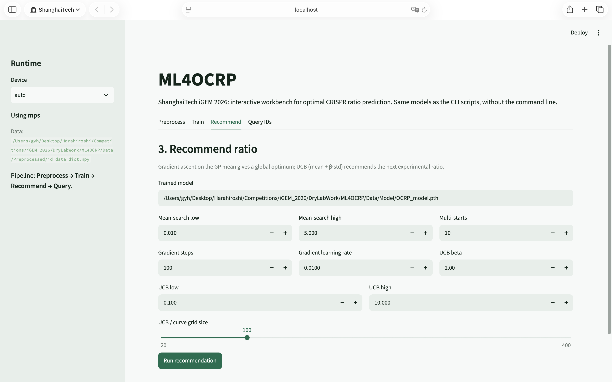

# ML4OCRP

Machine Learning for Optimal Cell Ratio Prediction. A cell group is observed as a short, noisy trajectory of ratio against time, and only a few ratios are scored. ML4OCRP learns the score of a ratio and recommends which ratio to measure next. A separate query asks, for each cell group, when a chosen ratio is reached.

The attainable ratios are treated as ten values. Measuring every candidate is expensive, so the model has to say something about ratios that were not measured, and it has to expose its uncertainty.

## Features

**Synthetic ratio table** (`InSilicoValidation/fitting_ratio.py`). Wet-lab trajectories are not required to test the model. The script integrates the modeling group's BxB1 recombination ODE and writes one trajectory per cell group. There are more groups than targets. At 24 h, each group's ratio lies near one of ten targets spaced logarithmically from 0.5 to 6.

**Score functions** (`InSilicoValidation/fitting_score.py`). A ratio is not yet a decision. This script turns the ratio table into a score with one of five shapes: a symmetric peak, a skewed peak, two peaks, an increasing sigmoid, or a straight ramp. The default is the symmetric peak, so an old command that omits `--score_fn` still runs.

**Merge by cell group** (`Model/preprocess_data.py`). Ratio and score arrive as two tables. Training needs one series per group. The script joins them on cell-group id and time and writes `id_data_dict.npy`.

**Learn score against ratio** (`Model/ocrp_model_train.py`). A lookup over the measured ratios cannot score a ratio in between, and it cannot say which unmeasured ratio would reduce uncertainty. Training pretrains a small encoder, freezes it, and fits a deep-kernel Gaussian process on the ratio together with that embedding. The process returns a mean and a standard deviation.

**Choose a ratio** (`Model/predict_ratio_and_recommend_by_ucb.py`). After training, two readings of the same posterior answer two questions. The posterior mean names the ratio with the highest predicted score. Upper confidence bound, mean plus β times the standard deviation, names the next ratio to sample, including one the model is still unsure about. The default β is 2.

**Time to a target ratio** (`Model/query_per_id.py`). The score model does not know time. Given a target ratio, this script asks each cell group whether that ratio already appeared, is predicted later, or is not reached. With `--fit_ode`, the fit uses the BxB1 ODE and then a residual. The modeling group derived that equation. This script fits its parameters to one group. It does not derive the equation.

**Check a predicted time** (`InSilicoValidation/get_actual_ratio.py`). A predicted time still has to be compared with the ODE that generated the synthetic group. This script integrates that ODE at each predicted `(id, time)` and writes the ratio it produces.

**Score-shape check** (`InSilicoValidation/test_score_shapes.py`). A model that only works for a symmetric peak is not enough. This script builds one ratio table, scores it with each of the five functions, trains with the default schedule, and records the error of the predicted optimum.

**Workbench** (`app.py`). The same four jobs — merge, train, recommend, and query — can be run without the command line. The page imports `Model/`, so a checkpoint saved with `hidden_dim` left at 32 can be loaded by the scripts, and the other way around.

## Architecture

Gray boxes in the flowchart are scripts. Blue boxes are files they write. The order matches `Val.sh`.



**Figure 1.** The in silico check runs from synthetic 24 h ratios through training and a per-group time query to an ODE comparison at the predicted times.

The score network is not the time query. After pretraining, the auxiliary score head is unused. The Gaussian process reads the raw ratio concatenated with the frozen embedding.



**Figure 2.** Mean and UCB are two readouts of the same posterior. The time query is a different program.

## Install

From `ML4OCRP/`, the setup script creates a conda environment named `ocrp` with Python 3.13, installs the pinned packages in `requirements.txt`, and creates the four `Data/` directories.

Windows:

```powershell
powershell -ExecutionPolicy Bypass -File setup_env.ps1
conda activate ocrp
$env:KMP_DUPLICATE_LIB_OK = "TRUE"
```

Mac:

```bash
bash setup_env.sh
conda activate ocrp
export KMP_DUPLICATE_LIB_OK=TRUE
```

On Mac the script looks for `conda` on `PATH`, then in the usual Miniconda, Anaconda, and Miniforge locations, including `/opt/miniconda3`. `Val.sh` still has its own machine-specific root and must be edited before use. This setup script does not run the pipeline.

The versions in `requirements.txt` are the ones this project was run with. PyTorch is installed from PyPI. A machine with a CUDA wheel available will use CUDA when the training script asks for it.

Python 3. Package roles:

| Package | Used for |
| --- | --- |
| NumPy | Arrays and `.npy` dictionaries |
| pandas | CSV tables |
| PyTorch | Encoder, Gaussian-process tensors, and device selection |
| GPyTorch | Exact deep-kernel Gaussian process |
| SciPy | ODE integration and parameter fitting |
| scikit-learn | Residual Gaussian process in the time query |
| tqdm | Progress bar in the per-group query |
| Matplotlib | Figures from `test_score_shapes.py` |
| Streamlit | `app.py` only |

On Windows and Mac, PyTorch and the Intel OpenMP runtime used by NumPy can abort at import. The activate lines above set `KMP_DUPLICATE_LIB_OK` for that terminal.

`test_score_shapes.py` sets the variable for the training subprocesses. `app.py` sets it before importing the libraries. A direct call to `ocrp_model_train.py` does not.

Training selects MPS, then CUDA, then CPU when `--device` is omitted. Ratio recommendation selects CUDA, then CPU.

`Val.sh` is a bash copy of the seven-step pipeline. Its `PROJECT_ROOT` points at another machine, and it activates a conda environment named `ocrp`. Change both before running it. The commands below do not use that script.

The default CLI paths are `Data/Original`, `Data/Preprocessed`, `Data/Model`, and `Data/Predict`, relative to `ML4OCRP/`. `preprocess_data.py` and `ocrp_model_train.py` create their output directories. `predict_ratio_and_recommend_by_ucb.py` and `query_per_id.py` do not. Those four directories need to exist before a default run.

## Usage

Run the commands from the directory shown. Relative paths inside the scripts are resolved from the working directory.

### Score-shape check

This is the run behind the result table and Figures 3–6. Defaults are 40 cell groups, seed 0, 100 pretraining epochs, and 200 Gaussian-process epochs. The search interval is `[0.5, 6]`, the same interval as the targets.

```powershell
cd InSilicoValidation
python test_score_shapes.py
```

The script writes `InSilicoValidation/results/score_shape_summary.csv` and one checkpoint directory per score function. It also overwrites the matching SVG files in `SoftwareWiki/figures`. The copies in `figures/` next to this README are from that default run.

### Command-line pipeline

From `InSilicoValidation/`:

```powershell
python fitting_ratio.py
python fitting_score.py
```

From `Model/`:

```powershell
python preprocess_data.py
python ocrp_model_train.py
python predict_ratio_and_recommend_by_ucb.py
python query_per_id.py --fit_ode --max_time 24
```

`--fit_ode` is off unless you pass it. Fitting the ODE for every group is the slow step. `--max_time` defaults to 12 h. The synthetic table ends at 24 h, so a query of that table needs the longer horizon.

From `InSilicoValidation/` again, after the query has written `Data/Predict/predict_id_time_dict.npy`:

```powershell
python get_actual_ratio.py
```

Every flag is listed in `Model/SCRIPT_ARGUMENTS.md`.

### Workbench

From the `ML4OCRP` root:

```powershell
streamlit run app.py
```

The query tab walks cell groups one at a time so the page can show a progress bar. It does not start the process pool used by `query_per_id.py`.

## Results

The table is the default score-shape check: seed 0, 100 pretraining epochs, 200 Gaussian-process epochs, search on `[0.5, 6]`. The true optimum is the maximum of the scoring function on a 401-point grid. That grid sits slightly off the analytic peaks at 2.50 and 4.00, which is why the Gaussian regret in `score_shape_summary.csv` prints a value just below zero. Unrounded rows are in that file.

| Scoring function | True optimum | Predicted | Abs. error | Regret | Score RMSE | UCB |
| --- | ---: | ---: | ---: | ---: | ---: | ---: |
| Gaussian | 2.494 | 2.506 | 0.012 | 0 | 0.010 | 2.500 |
| Log-Gaussian | 2.494 | 2.475 | 0.018 | 0.0004 | 0.010 | 2.444 |
| Bimodal | 4.006 | 3.727 | 0.279 | 0.207 | 0.077 | 3.722 |
| Sigmoid | 6.000 | 6.000 | 0 | 0 | 0.004 | 6.000 |
| Linear | 6.000 | 6.000 | 0 | 0 | 0.031 | 6.000 |

Single-peak and monotonic scores stay within 0.02 of the grid optimum. The two-peak score is the loose case: the prediction is 3.73 and the grid peak is 4.01, with regret 0.21. UCB on that fit recommends 3.72.



**Figure 3.** Each group's ratio at 24 h lies near one of ten targets spaced logarithmically from 0.5 to 6.



**Figure 4.** The check scores the same ratios with five shapes: two single peaks, two peaks, an increasing sigmoid, and a linear ramp.


**Figure 5.** OCRP recovers the single-peak and monotonic scores. The two-peak score is the loose case.


**Figure 6.** Absolute error stays within 0.02 except for the two-peak function, whose regret is 0.21.

### Workbench



**Figure 7.** The Preprocess tab accepts the ratio and score tables, or an existing `id_data_dict.npy`.



**Figure 8.** After the merge, every ratio–score pair is plotted with ratio on the horizontal axis and score on the vertical axis.


**Figure 9.** Training uses the same encoder and deep-kernel Gaussian process as the command line.


**Figure 10.** A finished run writes `OCRP_model.pth`. With `hidden_dim` left at 32, that checkpoint can be loaded by the command-line scripts.



**Figure 11.** Recommendation searches the posterior mean for the best ratio and scores a grid with UCB.


**Figure 12.** The plotted mean is the predicted score. The UCB curve, mean plus β times the standard deviation, marks the next ratio to sample.


**Figure 13.** The query walks cell groups one at a time so the page can show progress. It does not start the command-line process pool.


**Figure 14.** Each group returns a time and a status: already seen, predicted in the future, or not reached.

## References and third-party tools

The BxB1 recombination ODE and its default kinetic constants come from the modeling subgroup. Their notebook, `Model/model_1.0.ipynb` in the project root, attributes the five-state equation and the parameter set (`k_A0 = 0.38 h⁻¹`, `k_B0 = 0.14 h⁻¹`, `β = 1.3`, `r_A = 0.56 h⁻¹`, `r_B = 0.01 h⁻¹`, `α = 0.01`) to Zhong et al. 2026, *Nature*. This repository does not contain the DOI or the article title. The 24 h stop used by `fitting_ratio.py` is the notebook's `steady_state_fraction`, not a mathematical drain-out time.

The deep-kernel Gaussian process is GPyTorch's exact GP with a learned feature map. The next-experiment rule is upper confidence bound on that posterior. No other paper is cited in this code.

Third-party libraries are the packages in the install table: NumPy, pandas, PyTorch, GPyTorch, SciPy, scikit-learn, tqdm, Matplotlib, and Streamlit.
